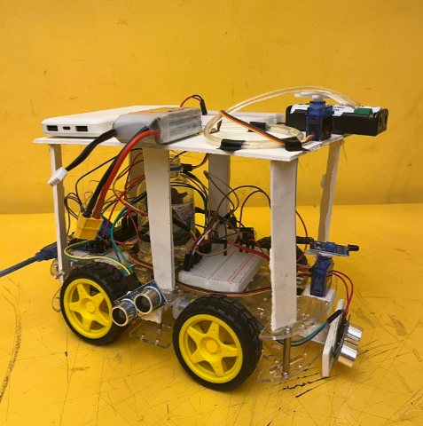

# Autonomous Fire Fighting Robot



## Overview

This project is an Arduino-based **Autonomous Fire Fighting Robot** designed to detect fire, scan the surrounding area, move using DC motors, aim the nozzle with a servo motor, and activate a **3–12V DC water pump through a relay module** to extinguish small flames automatically.

The robot uses a flame sensor mounted on a servo motor to scan the environment. When fire is detected, the robot stops, aims the nozzle toward the detected fire direction, turns on the relay-controlled water pump, sprays water for a short time, and then continues scanning.

## Features

- Detects fire using a flame sensor
- Uses a servo motor to rotate the flame sensor and scan the surroundings
- Uses a separate servo motor to aim the nozzle toward the flame
- Controls robot movement using DC motors and a motor driver
- Activates a 3–12V DC water pump through a relay module
- Sprays water automatically to extinguish small flames
- Demonstrates embedded control, sensor-based detection, motor control, and fire safety automation

## Hardware Components

| Component | Quantity | Purpose |
|---|---:|---|
| Arduino UNO | 1 | Main controller of the robot |
| Flame Sensor | 1 | Detects flame presence and direction |
| Servo Motor | 2 | One for scanning, one for nozzle aiming |
| L298N Motor Driver | 1 | Controls DC motors |
| DC Motors | 4 | Moves the robot |
| Relay Module | 1 | Safely controls the water pump |
| 3–12V DC Water Pump | 1 | Pumps water for extinguishing fire |
| Water Tank | 1 | Stores water |
| Nozzle and Pipe | 1 set | Sprays water toward the flame |
| Battery / Power Supply | 1 | Powers the robot system |
| Jumper Wires and Chassis | As needed | Circuit connection and robot body |

## Pin Configuration

| Module | Arduino Pin |
|---|---|
| Flame Sensor | D2 |
| Water Pump Relay | D4 |
| Scanning Servo | D13 |
| Nozzle/Aiming Servo | D12 |
| Motor Driver IN1 | D8 |
| Motor Driver IN2 | D9 |
| Motor Driver IN3 | D10 |
| Motor Driver IN4 | D11 |

## Circuit Notes

The water pump is not connected directly to the Arduino pin because it requires more current than an Arduino digital pin can safely provide. A relay module is used between the Arduino and the pump.

Basic relay connection:

```text
Arduino D4  -> Relay IN
Arduino 5V  -> Relay VCC
Arduino GND -> Relay GND

Battery +   -> Relay COM
Relay NO    -> Pump +
Pump -      -> Battery -
```

All modules should share a common ground where required.

## Working Principle

1. The scanning servo rotates the flame sensor from side to side.
2. The flame sensor continuously checks for fire.
3. If fire is detected, the robot stops moving.
4. The nozzle servo aims toward the detected scan angle.
5. The Arduino turns on the relay module.
6. The relay activates the 3–12V water pump.
7. Water is sprayed toward the fire source.
8. After spraying, the pump turns off and the robot continues scanning.

## Arduino Code

The main code is written using the Arduino IDE and the Servo library.

Required library:

```cpp
#include <Servo.h>
```

Upload the `.ino` file to the Arduino UNO using the Arduino IDE.

## Project Structure

```text
Autonomous-Fire-Fighting-Robot/
│
├── README.md
├── firefighter.ino
├── images/
│   └── final_robot.png
└── report.pdf
```

## How to Use

1. Connect all components according to the circuit connection.
2. Place the robot on a flat surface.
3. Fill the water tank with a small amount of water.
4. Upload the Arduino code.
5. Power the Arduino, motors, servos, relay module, and pump properly.
6. Test the robot in a controlled environment using a small flame source.

## Safety Warning

This robot is a small-scale academic prototype. It should only be tested in a safe and controlled environment. It is not designed to replace professional fire-fighting equipment. Keep water away from exposed electronic parts and avoid testing with large flames.

## Applications

- Small-scale fire safety demonstration
- Robotics lab project
- Embedded system learning
- Arduino-based automation project
- Fire detection and response prototype

## Future Improvements

- Add ultrasonic obstacle avoidance
- Improve fire detection accuracy
- Add wireless monitoring
- Use a larger water tank and stronger pump
- Add automatic return-to-base feature
- Improve chassis stability and battery backup

## Team

This project was developed as an academic robotics project by-
- Nashrah Zakir
- Sharmin Sulatana Annie
- Nusrat Jahan Urmi
- Lubna Akter

## License

This project is for educational and academic use.
